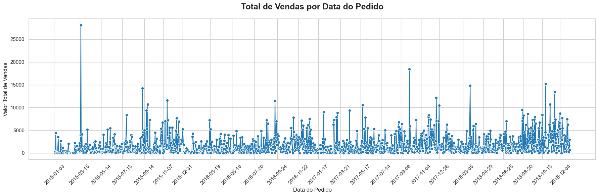
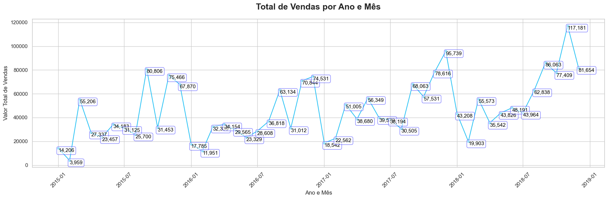
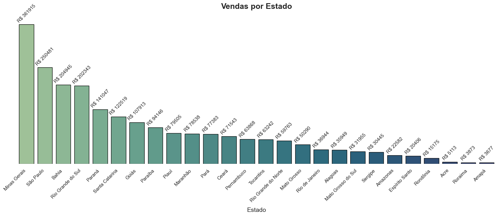
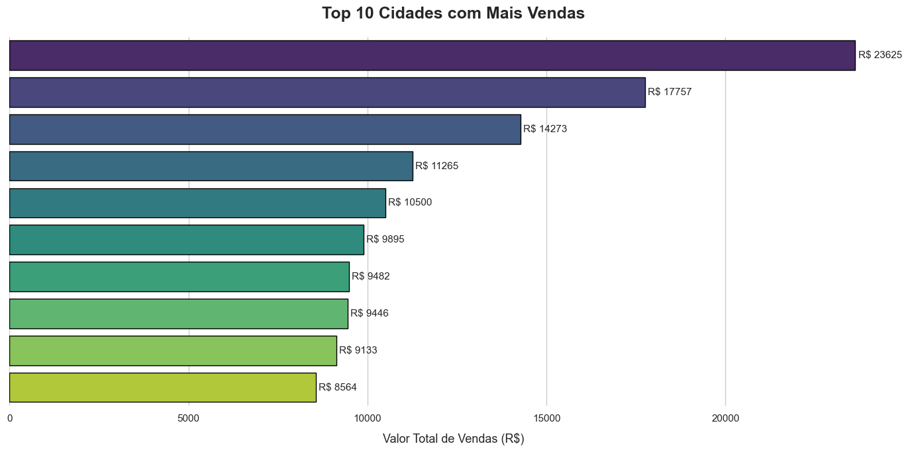
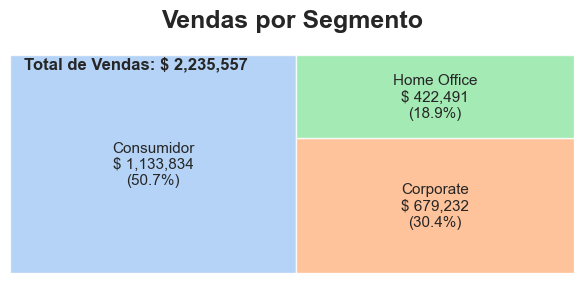
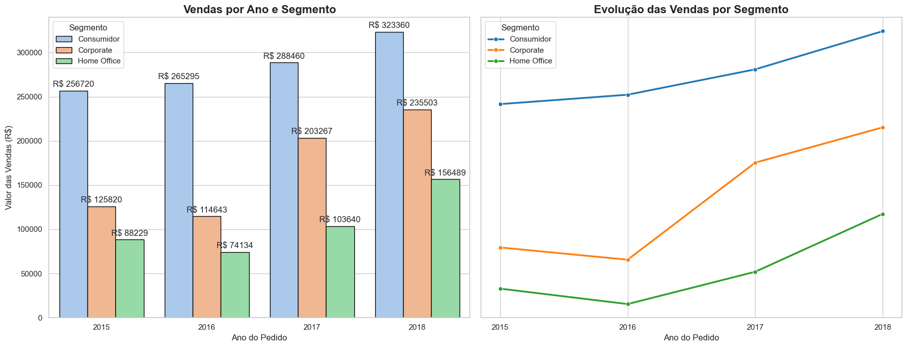
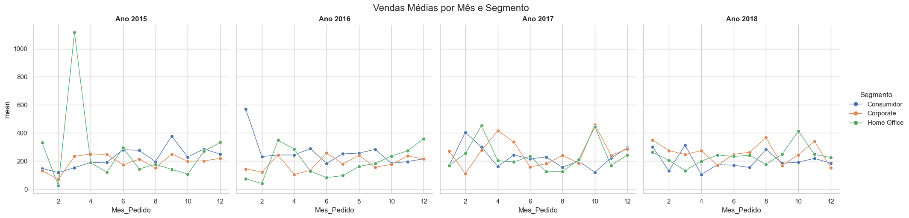
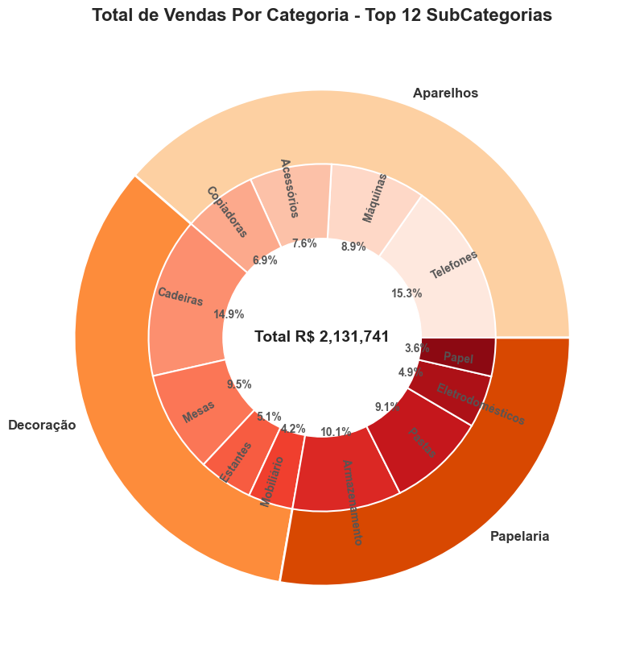

# Análise Exploratória de Dados – Vendas no Varejo

Este repositório contém exemplos para análise exploratória realizada em Python, utilizando um conjunto de dados fictício de vendas no varejo.  
O objetivo é treinar técnicas de **EDA (Exploratory Data Analysis)**, identificar padrões, tendências e anomalias.

---

## Índice
1. [Cidade com maior valor de venda de produtos da categoria X](#1-cidade-com-maior-valor-de-venda-de-produtos-da-categoria-x)  
2. [Categoria mais vendida por estado](#2-categoria-mais-vendida-por-estado)  
3. [Mês com maior faturamento total](#3-mês-com-maior-faturamento-total)  
4. [Produto mais vendido em quantidade](#4-produto-mais-vendido-em-quantidade)  
5. [Ticket médio por cliente](#5-ticket-médio-por-cliente)  
6. [Distribuição de vendas por forma de pagamento](#6-distribuição-de-vendas-por-forma-de-pagamento)  
7. [Top 10 clientes com maior valor gasto](#7-top-10-clientes-com-maior-valor-gasto)  
8. [Evolução das vendas ao longo do tempo](#8-evolução-das-vendas-ao-longo-do-tempo)  
9. [Correlação entre quantidade e valor total](#9-correlação-entre-quantidade-e-valor-total)  
10. [Resumo geral das métricas principais](#10-resumo-geral-das-métricas-principais)  

## 1. Cidade com maior valor de venda de produtos da categoria X
**Como resolvi:** Filtrei os dados pela categoria desejada e utilizei `groupby` para somar as vendas por cidade.  
**Resultado:** Identifiquei a cidade com maior faturamento.  

 - Cidade: Arraias  `R$ 9895.036`

## 2. Categoria mais vendida por estado
**Como resolvi:** Agrupei os dados por estado e categoria, buscando a de maior soma de vendas em cada estado.  
**Resultado:** Cada estado tem uma categoria predominante.  

## 3. Mês com maior faturamento total
**Como resolvi:** Extraí o mês da coluna de data e somei o faturamento por mês.  
**Resultado:** O mês com maior valor aparece claramente.  

## 4. Produto mais vendido em quantidade
**Como resolvi:** Agrupei os dados por produto e somei a quantidade.  
**Resultado:** Produto com maior número de unidades vendidas.  

## 5. Ticket médio por cliente
**Como resolvi:** Dividi o total gasto por cada cliente pelo número de compras realizadas.  
**Resultado:** Média de valor gasto por compra.  

## 6. Distribuição de vendas por forma de pagamento
**Como resolvi:** Contabilizei e calculei a proporção de cada tipo de pagamento.  
**Resultado:** Mostra as preferências dos clientes.  

## 7. Top 10 clientes com maior valor gasto
**Como resolvi:** Ordenei os clientes pelo valor total gasto e selecionei os 10 primeiros.  
**Resultado:** Ranking dos maiores clientes.  

| Desconto | Quantidade de Vendas |
|----------|-----------------------|
| 0.10     | 6049                  |
| 0.15     | 3651                  |

## 8. Evolução das vendas ao longo do tempo
**Como resolvi:** Agrupei as vendas por data (ou mês) para verificar a tendência temporal.  
**Resultado:** Crescimento, queda ou sazonalidade identificada.  

- Média das vendas ANTES do desconto de 15%:  `R$ 560.27`
- Média das vendas DEPOIS do desconto de 15%: `R$ 476.23`

## 9. Correlação entre quantidade e valor total
**Como resolvi:** Calculei a correlação entre as variáveis `quantidade` e `valor_total`.  
**Resultado:** Indica se clientes que compram mais unidades também gastam mais.  

## 10. Resumo geral das métricas principais
**Como resolvi:** Consolidei estatísticas gerais como: faturamento total, ticket médio geral, produto mais vendido e categoria mais lucrativa.  
**Resultado:** Visão consolidada da análise.  

## Tecnologias Utilizadas
- Python  
- Pandas, NumPy  
- Matplotlib, Seaborn  
- Jupyter Notebook  

