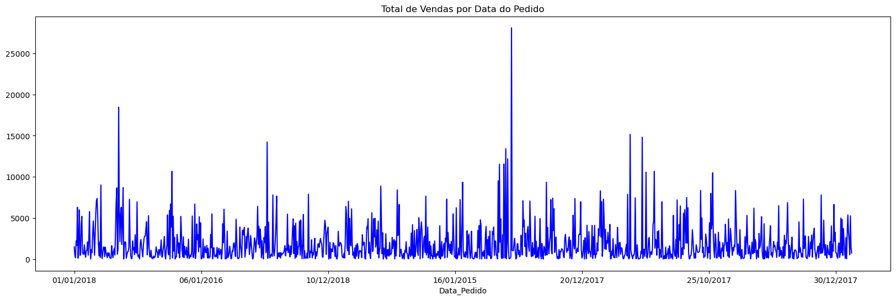
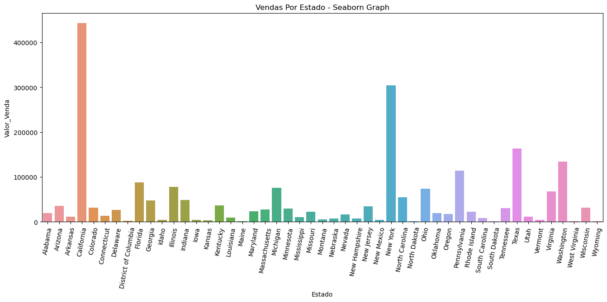
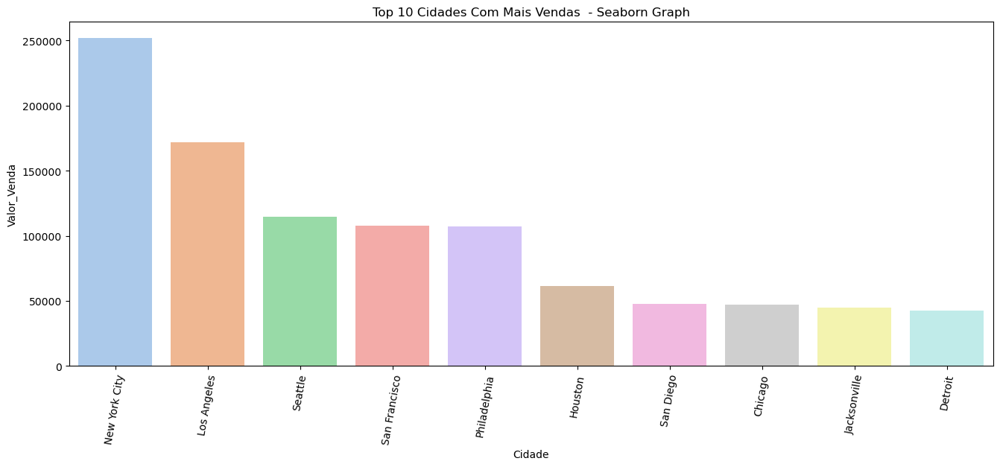

# Análise Exploratória de Dados (EDA) para Varejo
Este projeto consiste em uma análise exploratória de dados (EDA) com foco no setor de varejo, utilizando um conjunto de dados fictício que simula vendas no varejo. O principal objetivo é aplicar técnicas de EDA para extrair insights úteis dos dados, utilizando a linguagem Python.

Total de vendas ao longo do período.

## Conjunto de Dados
O dataset utilizado simula vendas no varejo e inclui várias variáveis típicas desse contexto, como categorias de produtos, valor de vendas, data do pedido, entre outras.

## Objetivo
O objetivo principal é treinar e aplicar técnicas de análise exploratória de dados (EDA) para compreender melhor as características do conjunto de dados, identificar padrões, tendências, e possíveis anomalias.

Total de vendas por estado.

## Ferramentas Utilizadas
- Python 3
- Bibliotecas: Pandas, NumPy, Seaborn, Matplotlib, e DateTime.

## Procedimentos Realizados

1. **Carregamento dos Dados**: Leitura do conjunto de dados a partir de um arquivo CSV.

2. **Análise Preliminar**: Inclui a verificação de dimensões do dataset, tipos de dados, e um resumo estatístico de variáveis específicas.

3. **Limpeza dos Dados**: Identificação e tratamento de valores ausentes e duplicados.

4. **Análise Exploratória Detalhada**: Respostas a perguntas de negócios específicas através de análises estatísticas e visualizações, incluindo:
   - Identificação da cidade com maior valor de vendas em uma categoria específica.
   - Análise do total de vendas por data, estado, e cidade.
   - Análise do total de vendas por segmento, incluindo uma visualização em gráfico de pizza.
   - Análise do total de vendas por segmento e por ano.
   - Simulação de diferentes faixas de descontos e análise de impacto no valor médio de vendas antes e depois dos descontos.
   - Análise da média de vendas por segmento, por ano e por mês.
   - Análise do total de vendas por categoria e subcategoria, focando nas top 12 subcategorias.

## Resultados Principais
O projeto detalha passo a passo a aplicação de técnicas de EDA para responder a perguntas de negócios relevantes, apresentando os resultados através de tabelas e gráficos explicativos.

## Conclusão
Este projeto demonstra a aplicação prática de técnicas de análise exploratória de dados no contexto do varejo, fornecendo insights valiosos que podem ajudar na tomada de decisões estratégicas.

Top 10 cidades com mais vendas.
---
